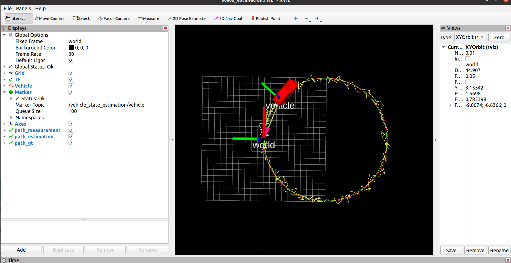

## 第二章作业_BITC罗

#### 解题思路

主要根据PPT推倒出的预测和观测公式填写代码，注意成上时间间隔和处理yaw角范围限定的问题

#### 代码实现

```cpp
void EkfPredict(State& state, const double &time, const double &velocity, const double &yaw_rate) {
    // printf("time %lf, velocity %lf, yaw_rate %lf \n", time, velocity, yaw_rate);
    // YOUR_CODE_HERE
    // todo: implement the EkfPredict function
    double dt = time - state.time;

    double x_t = state.x;
    double y_t = state.y;
    double yaw_t = state.yaw;

    double x_t1 = x_t + velocity*cos(yaw_t)*dt;
    double y_t1 = y_t + velocity*sin(yaw_t)*dt;
    double yaw_t1 = yaw_t + yaw_rate*dt;

    Eigen::Matrix3d A_t = Eigen::Matrix3d::Zero();
    A_t(0,2) = -velocity * sin(yaw_t);
    A_t(1,2) =  velocity * cos(yaw_t);
    A_t = A_t * dt;

    Eigen::Matrix<double, 3, 2> U_t;
    U_t << cos(yaw_t),0,
           sin(yaw_t),0,
           0, 1;
    U_t = U_t * dt;

    state.x = x_t1;
    state.y = y_t1;
    state.yaw = yaw_t1;
    state.time = time;
    state.P = A_t * state.P * A_t.transpose() + U_t * Qn * U_t.transpose();

    // printf("after predict x: %lf, y: %lf, yaw: %lf \n", state.x, state.y, state.yaw);
}

void EkfUpdate(State& state,  const double &m_x, const double &m_y, const double &m_yaw) {
    // printf("time :%lf \n", state.time);
    // printf("before update x: %lf, y: %lf, yaw: %lf \n", state.x, state.y, state.yaw);
    // printf("measure x: %lf, y: %lf, yaw: %lf \n", m_x, m_y, m_yaw);
    // YOUR_CODE_HERE
    // todo: implement the EkfUpdate function
    Eigen::Matrix3d C_t = Eigen::Matrix3d::Identity();

    double yaw_error = m_yaw - state.yaw;

    Eigen::Vector3d z(m_x, m_y, m_yaw);
    Eigen::Vector3d z_pre(state.x, state.y, state.yaw);
    Eigen::Vector3d y_ = z - z_pre;

    while(y_(2) > M_PI) y_(2) -= 2.0*M_PI;
    while(y_(2) < -M_PI) y_(2) += 2.0*M_PI;

    Eigen::Matrix3d W_t = C_t * state.P * C_t.transpose() + Rn;

    Eigen::Matrix3d K = state.P * C_t.transpose() * W_t.inverse();

    Eigen:: Vector3d dx = K * y_;
    state.x += dx(0);
    state.y += dx(1);
    state.yaw += dx(2);

    while(state.yaw > M_PI) state.yaw -= 2.0 * M_PI;
    while(state.yaw < -M_PI) state.yaw += 2.0 * M_PI;

    // Eigen::Marix3d I = Eigen::Matrix3d::Identity();
    state.P = state.P - K * C_t * state.P;

    // printf("after update x: %lf, y: %lf, yaw: %lf \n", state.x, state.y, state.yaw);
}
```

#### RVIZ截图

