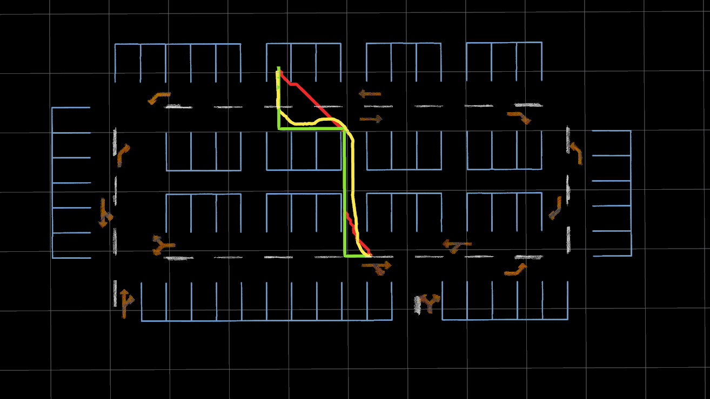

## 第七章作业_BITC罗


```cpp
vector<Vector2i> Planner::Bfs(const Vector2i &start, const Vector2i &goal,
                     const unordered_set<Vector2i, Vector2iHash>& obstacles) {

    queue<Vector2i> q;  // BFS 队列
    unordered_map<Vector2i, Vector2i, Vector2iHash> open_from; // 记录父节点

    q.push(start);
    open_from[start] = start;  // 起点的父节点设为自身

    // 定义八个移动方向（上、下、左、右）
    vector<Vector2i> directions = { {0, 1}, {0, -1}, {1, 0}, {-1, 0},
                                    {1, 1}, {1, -1}, {-1, 1}, {-1, -1}};

    while (!q.empty()) {
        Vector2i current = q.front();
        q.pop();

        // 如果找到目标点，则回溯路径
        if (current == goal) {
            vector<Vector2i> path;
            while (current != start) {
                path.push_back(current);
                current = open_from[current];
            }
            path.push_back(start);
            reverse(path.begin(), path.end()); // 反转路径
            return path;
        }

        // 遍历所有方向
        for (const auto& dir : directions) {
            Vector2i next = current + dir;
            if (obstacles.find(next) == obstacles.end() && open_from.find(next) == open_from.end()) {
                q.push(next);
                open_from[next] = current; // 记录父节点
            }
        }
    }

    return {}; // 未找到路径

    // return vector<Vector2i>();
}


vector<Vector2i> Planner::AStar(const Vector2i &start, const Vector2i &goal,
                                const unordered_set<Vector2i, Vector2iHash>& obstacles) {
                                    
    // 自定义比较器，使 priority_queue 只基于 f 值排序
    struct ComparePair {
        bool operator()(const pair<double, Vector2i>& a, const pair<double, Vector2i>& b) const {
            return a.first > b.first;  // f 值小的优先级高
        }
    };

    // A* 开放列表（优先队列，按 f 值排序）
    priority_queue<pair<double, Vector2i>, vector<pair<double, Vector2i>>, ComparePair> open_set;

    // 记录路径（用于回溯）
    unordered_map<Vector2i, Vector2i, Vector2iHash> came_from;

    // g 值：存储从起点到当前点的最小代价
    unordered_map<Vector2i, double, Vector2iHash> g_cost;

    // 启发式函数（欧几里得距离）
    auto heuristic = [](const Vector2i &a, const Vector2i &b) {
        return (a - b).cast<double>().norm();
    };

    // 初始化起点
    open_set.emplace(0, start);
    g_cost[start] = 0;
    came_from[start] = start;

    // 定义八个移动方向（上、下、左、右）
    vector<Vector2i> directions = { {0, 1}, {0, -1}, {1, 0}, {-1, 0},
                                    {1, 1}, {1, -1}, {-1, 1}, {-1, -1}};
    // int step_size = 3; // 设定步长，每步走 3 个单位
    // vector<Vector2i> directions = {
    //     {step_size, 0}, {-step_size, 0}, {0, step_size}, {0, -step_size}, // 直线方向
    //     {step_size, step_size}, {-step_size, -step_size}, {step_size, -step_size}, {-step_size, step_size} // 对角线方向
    // };

    constexpr static double ORTHO_COST = 1.0;      // 上、下、左、右代价
    constexpr static double DIAG_COST = 1.414;     // 对角线移动代价

    while (!open_set.empty()) {
        Vector2i current = open_set.top().second;  // 取出 f 值最小的节点
        open_set.pop();
        
        if (current == goal) {  // 找到目标点，回溯路径
            vector<Vector2i> path;
            while (current != start) {
                path.push_back(current);
                current = came_from[current];
            }
            path.push_back(start);
            reverse(path.begin(), path.end());  // 逆序得到正确路径
            return path;
        }
        
        // 遍历相邻节点
        for (int i = 0; i < directions.size(); ++i) {
            Vector2i next = current + directions[i];
            if (obstacles.find(next) == obstacles.end()) {  // 确保不是障碍物
                double move_cost = (i < 4) ? ORTHO_COST : DIAG_COST; // 直线 vs 对角线
                double new_g = g_cost[current] + move_cost;  // 代价固定为 1（可以扩展为可变代价）
                
                // 如果 next 未访问，或找到更优路径
                if (g_cost.find(next) == g_cost.end() || new_g < g_cost[next]) {
                    g_cost[next] = new_g;
                    double f = new_g + heuristic(next, goal);  // 计算 f 值
                    open_set.emplace(f, next);
                    came_from[next] = current;
                }
            }
        }
    }

    return vector<Vector2i>();
}


std::vector<State*> Planner::HybridAStar(const State& start, const State& goal,
    const unordered_set<Vector2i, Vector2iHash>& obstacles_index,
    double wheelbase, double step_size, double max_steer) {

    // 1. 预处理 A* 参考路径用于启发式引导
    Vector2i start_index(round(start.x / step_size), round(start.y / step_size));
    Vector2i goal_index(round(goal.x / step_size), round(goal.y / step_size));
    vector<Vector2i> astar_path = Bfs(start_index, goal_index, obstacles_index);

    // 构造启发式查找表
    unordered_map<Vector2i, int, Vector2iHash> astar_lookup;
    for (int i = 0; i < astar_path.size(); ++i) {
        astar_lookup[astar_path[i]] = i;
    }

    // 2. 启发式函数，结合 A* 路径和 Euclidean 计算
    auto heuristic = [&goal, &astar_path, &astar_lookup, &step_size, &obstacles_index](const State* s) -> double {
        Vector2i current_index(round(s->x / step_size), round(s->y / step_size));
        if (astar_lookup.count(current_index) > 0) {
            return (astar_path.size() - astar_lookup[current_index]) * step_size;
        }

        // 计算与目标点的欧几里得距离
        double dx = s->x - goal.x, dy = s->y - goal.y;
        double euclidean_dist = sqrt(dx*dx + dy*dy);

        // 计算与障碍物的最小距离
        double min_obstacle_dist = 10000.0;
        for (const auto& obstacle : obstacles_index) {
            double dist = hypot(s->x - obstacle.x(), s->y - obstacle.y());
            min_obstacle_dist = std::min(min_obstacle_dist, dist);
        }

        // 加入障碍物距离的惩罚项，距离障碍物近时增加惩罚
        double obstacle_penalty = min_obstacle_dist < 4.0 ? 100.0 : 0.0; // 2.0可以根据实际情况调整

        return euclidean_dist + obstacle_penalty;
    };

    // 3. 离散化状态函数 (改进角度离散)
    auto discretizeState = [&step_size](const State* s) -> Vector2i {
        int x = round(s->x / (step_size * 0.5));
        int y = round(s->y / (step_size * 0.5));
        int theta = round(s->theta / (M_PI / 12.0)); // 每 15 度离散化
        return Vector2i(x * 1000 + theta, y);
    };

    // 4. 目标判定（允许一定范围内的终点）
    auto isGoalReached = [&goal, step_size](const State* s) -> bool {
        return hypot(s->x - goal.x, s->y - goal.y) < 2.0 * step_size;
    };

    // 5. 检查碰撞
    auto checkCollision = [&obstacles_index, step_size](const State* s) -> bool {
        Vector2i pos(round(s->x / step_size), round(s->y / step_size));
        return obstacles_index.count(pos) > 0;
    };

    // 6. 定义 Hybrid A* 的优先队列
    auto cmp = [](const State* a, const State* b) { return a->f > b->f; };
    priority_queue<State*, vector<State*>, decltype(cmp)> open_list(cmp);

    // 7. 初始化搜索
    State* startState = new State(start.x, start.y, start.theta, 0, heuristic(&start), nullptr);
    open_list.push(startState);
    unordered_set<Vector2i, Vector2iHash> closed_set;

    // 8. 定义可行转向角 (增加中间转向角，提高平滑度)
    vector<double> steer_angles = {-max_steer, -max_steer * 0.75, -max_steer/2, 0, max_steer/2, max_steer * 0.75, max_steer};

    // 9. Hybrid A* 主循环
    while (!open_list.empty()) {
        State* current = open_list.top();
        open_list.pop();

        if (isGoalReached(current)) {
            vector<State*> path;
            while (current != nullptr) {
                path.push_back(current);
                current = current->parent;
            }
            reverse(path.begin(), path.end());
            return path;
        }

        Vector2i discretized = discretizeState(current);
        if (closed_set.count(discretized) > 0) {
            delete current;
            continue;
        }
        closed_set.insert(discretized);

        // 10. 扩展子节点 (动态步长 & 平滑控制)
        for (double steer : steer_angles) {
            double beta = atan(tan(steer) / 2.0);
            double new_x = current->x + step_size * cos(current->theta + beta);
            double new_y = current->y + step_size * sin(current->theta + beta);
            double new_theta = current->theta + step_size * tan(steer) / wheelbase;

            while (new_theta > M_PI) new_theta -= 2 * M_PI;
            while (new_theta < -M_PI) new_theta += 2 * M_PI;

            // 使用较小步长提高轨迹平滑性
            double dynamic_step = step_size * (1.0 - 0.5 * fabs(steer / max_steer));
            new_x = current->x + dynamic_step * cos(current->theta + beta);
            new_y = current->y + dynamic_step * sin(current->theta + beta);
            new_theta = current->theta + dynamic_step * tan(steer) / wheelbase;

            State* next = new State(new_x, new_y, new_theta, current->g + dynamic_step, 0, current);

            if (checkCollision(next)) {
                delete next;
                continue;
            }

            next->f = next->g + heuristic(next);

            Vector2i next_discretized = discretizeState(next);
            if (closed_set.count(next_discretized) > 0) {
                delete next;
                continue;
            }

            open_list.push(next);
        }
    }
    return vector<State*>();
}

```

