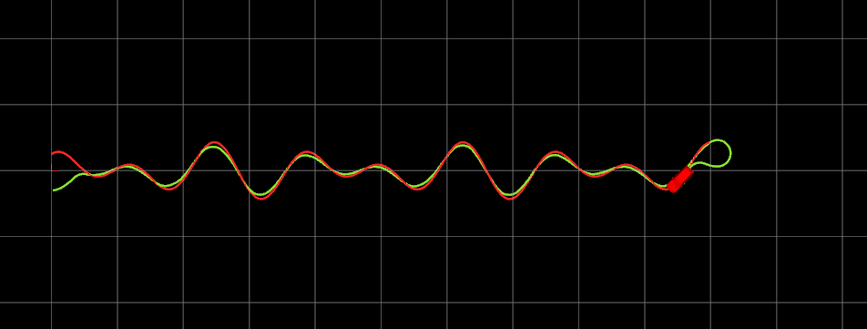
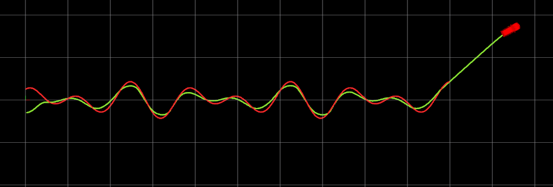
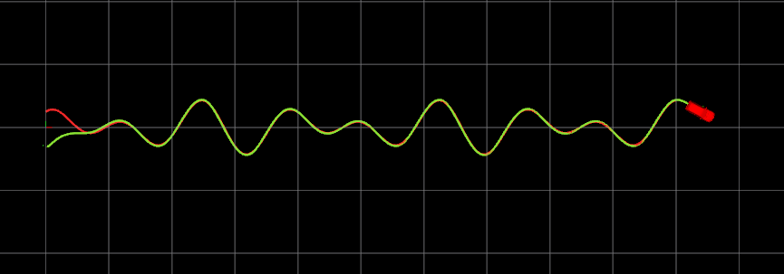

## BITC罗_第八章作业

### StanlyController
一定要注意寻找最近点的时候，要用前轮中心去寻找，而不是后轮中心，否则一直跟不上。
```cpp
 // Your code
    double L = ugv.L; // 轴距
    double epsilon = 1e-6;  // 避免除零错误
    double max_steering = PI / 4; // 最大转向角（30度）

    // **增益 k**
    double k = 5;  // 避免除零错误

    // **计算后轴位置**
    double psi = robot_state[2];  // 车辆航向角（车身方向）
    robot_state[0] = robot_state[0] + L * cos(psi);  // 车辆后轴 X 位置改为前轮
    robot_state[1] = robot_state[1] + L * sin(psi);  // 车辆后轴 X 位置改为前轮
    double y = robot_state[1];  // 车辆后轴 Y 位置
    double v = robot_state[3];  // 车辆速度
    
    // 找到最近的目标点
    int target_idx = calTargetIndex(robot_state, refer_path);
    vector<double> target_point = refer_path[target_idx];

    // **计算前轴位置**
    double x_f = robot_state[0];
    double y_f = robot_state[1];

    // **计算目标点的方向角**
    double psi_t = atan2(target_point[1] - y_f, target_point[0] - x_f);

    // **计算航向误差 θ_e**
    double theta_e = normalizeAngle(psi_t - psi);

    // **计算横向误差 e_y**
    double dx = target_point[0] - x_f;
    double dy = target_point[1] - y_f;
    // double e_y = sqrt(pow(dx, 2) + pow(dy, 2));
    double e_y = dy * cos(psi_t) - dx * sin(psi_t);  // 计算横向误差

    // 根据参考路径方向来确定横向误差的符号
    if ((robot_state[0] - target_point[0]) * sin(psi_t) - (robot_state[1] - target_point[1]) * cos(psi_t) > 0) {
        e_y = std::abs(e_y);  // 横向误差为正
    } else {
        e_y = -std::abs(e_y); // 横向误差为负
    }

    // **计算横向误差控制角 δ_e**
    double delta_e = atan2(k * e_y, v + epsilon);

    // **计算最终转向角 δ**
    double delta = theta_e + delta_e;

    // **限制转向角范围**
    if (delta > max_steering) delta = max_steering;
    if (delta < -max_steering) delta = -max_steering;

    // **调试输出**
    std::cout << "================ Stanley Debug ================\n";
    std::cout << "Target Index: " << target_idx << "\n";
    std::cout << "Vehicle Front (x_f, y_f): (" << x_f << ", " << y_f << ")\n";
    std::cout << "Target Point (x_t, y_t): (" << target_point[0] << ", " << target_point[1] << ")\n";
    std::cout << "Psi: " << psi << " | Psi_t: " << psi_t << "\n";
    std::cout << "Theta_e: " << theta_e << "\n";
    std::cout << "Lateral Error e_y: " << e_y << "\n";
    std::cout << "Gain k: " << k << "\n";
    std::cout << "Delta_e: " << delta_e << "\n";
    std::cout << "Final Steering Delta: " << delta << "\n";
    std::cout << "===============================================\n";

    return delta;
```
图片中超出一点是因为我用了前轮，会多找几米，还没更改这个错误



### PurePursuitController
```cpp
double l_d = 3; // 前视距离
    double L = 2; // 轴距
    robot_state[0] = robot_state[0] + l_d * cos(robot_state[2]);
    robot_state[1] = robot_state[1] + l_d * sin(robot_state[2]); 
     // 计算当前位置与目标路径上目标点的相对角度 alpha
     int target_idx = calTargetIndex(robot_state, refer_path);  // 获取当前目标点的索引
     vector<double> target_point = refer_path[target_idx];      // 获取目标点坐标
     
     // 计算车辆与目标点的相对角度 alpha
     double dx = target_point[0] - robot_state[0];
     double dy = target_point[1] - robot_state[1];
     double alpha = atan2(dy, dx) - robot_state[2];  // 车辆朝向与目标点方向之间的夹角
     
     // 计算转向角 δ，使用 Pure Pursuit 控制公式
     double delta = atan2(2.0 * L * sin(alpha), l_d);
     
     // 限制最大转向角为 ±45 度（0.7854 弧度）
     double max_steering_angle = 0.7854;  
     if (delta > max_steering_angle) delta = max_steering_angle;
     if (delta < -max_steering_angle) delta = -max_steering_angle;
     
     // 返回计算出的转向角
     return delta;
```
同样的问题，不知道这样做对不对



### LQR
```cpp
  // Your code
    // 车辆状态: robot_state = [x, y, psi]
    double x = robot_state[0]; // 当前车辆 x 位置
    double y = robot_state[1]; // 当前车辆 y 位置
    double psi = robot_state[2]; // 当前车辆航向角（psi）

    // 参考路径点（选择参考路径的目标点）
    int target_index = calTargetIndex(robot_state, refer_path);
    double target_x = refer_path[target_index][0];
    double target_y = refer_path[target_index][1];
    double target_yaw = refer_path[target_index][2];
    double target_k = refer_path[target_index][3];

    // 计算期望的前轮转角
    double ref_delta = atan2(ugv.L * target_k, 1);

    // 状态变量：车辆当前位置与航向误差
    double e_x = x - target_x; // 车辆在 x 轴上的误差
    double e_y = y - target_y; // 车辆在 y 轴上的误差
    double e_psi = psi - target_yaw; // 航向误差
    // double e_psi = 0; // 航向误差

    // 状态向量 [e_x, e_y, e_psi]
    VectorXd state(3);
    state << e_x, e_y, e_psi;

    VectorXd u_r(2);
    u_r << 0, ref_delta;

    vector<MatrixXd> state_space = ugv.stateSpace(ref_delta, target_yaw);

    MatrixXd A = state_space[0];
    MatrixXd B = state_space[1];
    
    MatrixXd Q(3, 3);
    MatrixXd R(2, 2);

    Q.setIdentity();
    R.setIdentity();

    Q *= 1;
    R *= 5;

    MatrixXd P = CalRicatti(A, B, Q, R);
    MatrixXd K = (R + B.transpose() * P * B).inverse() * B.transpose() * P * A;
    
    VectorXd u_star = -K * state;
    std::cout << "u_star: " << u_star << "\n";
    
    VectorXd u = u_star + u_r;

    return u(1);
```
#### 这里在参考曲线上添加了曲率计算，用来计算期望的前轮转角，这个方法不知道合适不合适，希望助教给解答一下

```cpp
//计算曲率:设曲线r(t) =(x(t),y(t)),则曲率k=(x'y" - x"y')/((x')^2 + (y')^2)^(3/2).
        refer_path[i][3] = (ddy * dx - ddx * dy) / pow((dx * dx + dy * dy), 3.0 / 2); // k计算
```

